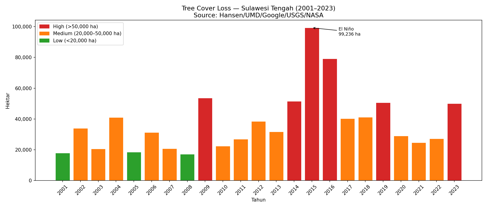

# 🌿 Cocoa Belt Deforestation Pipeline

A geospatial ETL pipeline that quantifies deforestation risk across Indonesia's cocoa-producing provinces using real satellite data from NASA — built in the context of **EUDR (EU Deforestation Regulation)** supply chain compliance.

---

## Overview

This pipeline ingests two public datasets:

- **Hansen Global Forest Change** (NASA/UMD) — GeoTIFF raster data at 28m resolution showing tree cover loss per year (2001–2023)
- **GADM v4.1** — vector boundaries for Indonesian provinces

It clips the raster data to each cocoa belt province, computes total tree cover loss in hectares, assigns a deforestation risk level, and outputs an interactive choropleth map and an annual loss bar chart.

---

## Pipeline Architecture

```
[GADM v4.1]          [Hansen GFC 2023]
Admin boundaries      NASA satellite raster
(vector / .gpkg)      (GeoTIFF / .tif)
        │                     │
        └──────────┬───────────┘
                   │
          Spatial clip (Rasterio)
          Province polygon × raster tile
                   │
          Zonal statistics
          Count loss pixels → hectares
                   │
          Risk classification
          High / Medium / Low
                   │
          ┌────────┴────────┐
          │                 │
   Bar chart           Interactive map
   (Matplotlib)        (Folium / HTML)
```

---

## Provinces Covered

| Province | Island |
|---|---|
| Sulawesi Tengah | Sulawesi |
| Sulawesi Tenggara | Sulawesi |
| Sulawesi Selatan | Sulawesi |
| Sulawesi Barat | Sulawesi |
| Sumatera Barat | Sumatra |
| Lampung | Sumatra |

These provinces represent the core of Indonesia's cocoa belt — responsible for the majority of national cocoa production and most exposed to EUDR compliance risk.

---

## Outputs

### Interactive Map
`cocoa_deforestation_map.html` — hover or click any province to see tree loss data.


### Annual Tree Loss Chart
`tree_loss_sulteng.png` — bar chart of annual tree cover loss in Sulawesi Tengah (2001–2023), with El Niño peak annotated.



---

## Technical Notes

**Tile resolution**
Hansen GFC tiles cover 10×10 degree grids at 28m/pixel resolution. Provinces that span multiple tiles (e.g. Sulawesi Tengah spans 4 tiles) are handled by auto-merging tiles before clipping.

**Pixel to hectare conversion**
```
1 pixel = 28m × 28m = 784 m² = 0.0784 ha
```

**Risk thresholds**
```
High   → > 100,000 ha total loss (2001–2023)
Medium → > 30,000 ha
Low    → ≤ 30,000 ha
```

**Hansen tile naming convention**
Tiles are named by their top-left corner coordinate:
```
tile '00N_120E' covers lat -10..0 / lon 120..130
```
The `get_tiles()` function automatically computes which tiles are needed for any given province bounds.

---

## Setup

```bash
git clone https://github.com/YOUR_USERNAME/cocoa-gis-pipeline
cd cocoa-gis-pipeline

python -m venv venv
venv\Scripts\activate        # Windows
source venv/bin/activate     # Mac/Linux

pip install -r requirements.txt
python pipeline.py
```

> **Note:** First run will download ~1.5GB of Hansen tiles and ~468MB of GADM data. Subsequent runs use cached files automatically.

---

## Requirements

```
geopandas
rasterio
folium
pandas
numpy
matplotlib
requests
contextily
```

---

## Data Sources

| Dataset | Provider | License |
|---|---|---|
| Hansen Global Forest Change v1.11 | Hansen/UMD/Google/USGS/NASA | CC BY 4.0 |
| GADM v4.1 | University of California Davis | Free for non-commercial use |

---

## Relevance to EUDR

The EU Deforestation Regulation (EUDR) requires companies trading cocoa, coffee, palm oil, and other commodities to prove their supply chains are free from deforestation after December 31, 2020. This pipeline demonstrates the core data engineering workflow behind such verification:

1. Ingest satellite-derived forest loss data
2. Clip to relevant supply chain geographies
3. Quantify risk at province level
4. Output compliance-ready datasets

---

## Author

**Salman Alfarizi** — Senior Data Engineer  
Stack: Python · GeoPandas · Rasterio · Folium · NumPy · Matplotlib
